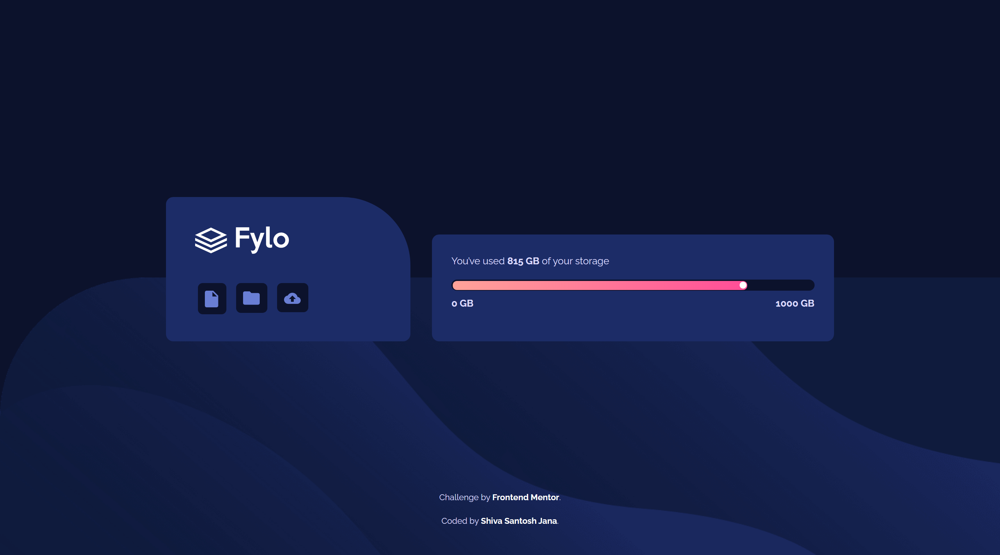
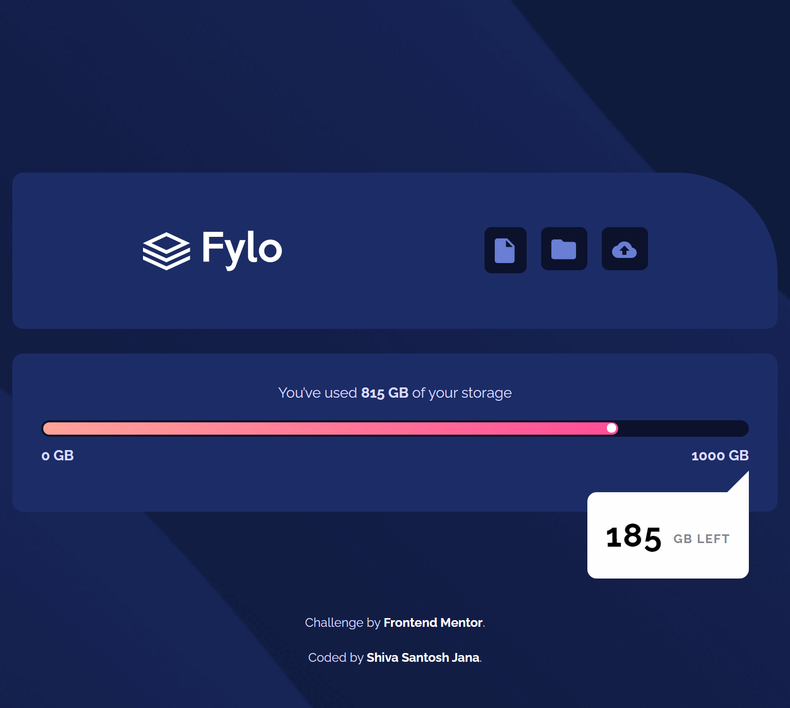
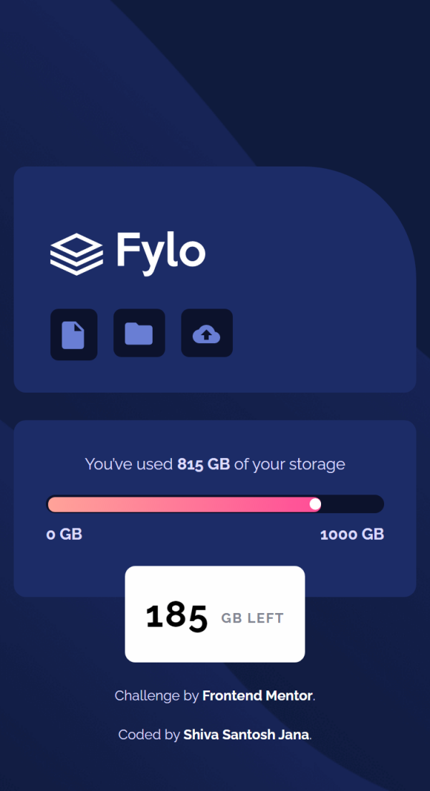

# Frontend Mentor - Fylo data storage component solution

This is a solution to the [Fylo data storage component challenge on Frontend Mentor](https://www.frontendmentor.io/challenges/fylo-data-storage-component-1dZPRbV5n). Frontend Mentor challenges help you improve your coding skills by building realistic projects.

## Table of contents

- [Overview](#overview)
  - [The challenge](#the-challenge)
  - [Screenshots](#screenshots)
  - [Links](#links)
- [My process](#my-process)
  - [Built with](#built-with)
  - [What I learned](#what-i-learned)
  - [Continued development](#continued-development)
  - [Useful resources](#useful-resources)
- [Author](#author)

## Overview

### The challenge

Users should be able to:

- View the optimal layout for the site depending on their device's screen size

### Screenshots

Desktop version

Tablet version

Mobile version

### Links

- Solution URL: [Code on GitHub](https://github.com/santu369/frontendmentor-fylo-data-storage-component)
- Live Site URL: [Netlify Live URL](https://santu369-frontendmentor-fylo-data-storage-component.netlify.app/)

## My process

Worked on Mobile first approach, then added media queries, adjusting the layout.
First time tried to build a component using bootstrap css, handled most of the cases using bbootstrap classes instead of using custom css.
Added small animations for the components to run on page load for only those who didn't set preference to reduce animations.

### Built with

- Semantic HTML5 markup
- CSS custom properties
- Flexbox
- CSS Grid
- Mobile-first workflow
- BEM Methodology
- SASS
- CSS Animations
- Bootstrap

### What I learned

Using Bootstrap CSS for quickly coming up with layouts.

### Continued development

Will work more with bootstrap for other challenges. Once comfortable, will implement react in further projects.

### Useful resources

- [Sass](https://sass-lang.com/) - Installing and Learning Sass.
- [BEM](https://en.bem.info/methodology/quick-start/) - Quick Start with BEM.
- [W3C Markup Validation Service](https://validator.w3.org/) - Validator for checking the markup validity of Web documents in HTML, XHTML, SMIL, MathML, etc.
- [W3C CSS Validation Service](https://jigsaw.w3.org/css-validator/) - Check Cascading Style Sheets (CSS) and (X)HTML documents with style sheets.
- [Reset CSS](https://meyerweb.com/eric/tools/css/reset/) - Strips away all the default browser styling.
- [@media>prefers-reduced-motion](https://developer.mozilla.org/en-US/docs/Web/CSS/@media/prefers-reduced-motion) - CSS media feature is used to detect if the user has requested that the system minimize the amount of non-essential motion it uses.
- [Bootstrap CSS](https://getbootstrap.com/docs/5.0/getting-started/introduction/)

## Author

- Website - [Shiva Santosh Jana](https://santu369.github.io/FreeCodeCamp-PersonalPortfolioWebpage)
- Frontend Mentor - [@santu369](https://www.frontendmentor.io/profile/santu369)
- Twitter - [@santu69](https://www.twitter.com/santu69)
